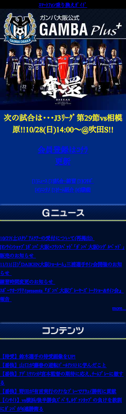
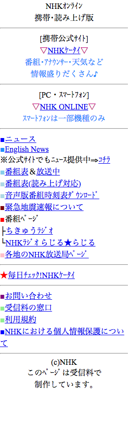
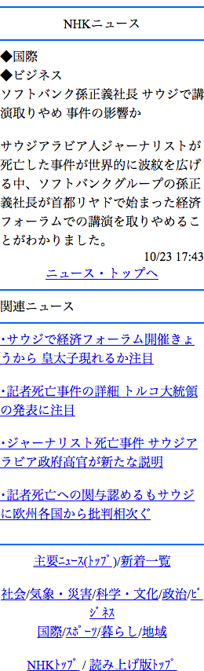

# fp-scraper

 * フィーチャーフォン(ガラケー)のスクレイピング
 * UIDの設定とXMLパースエラーの回避

||||||
|:---:|:---:|:---:|:---:|:---:|

## Getting Started

### Installation

```
npm i fp-scraper
```

### Usage

#### (1) Simple

```js
const scraper = require('fp-scraper');

(async () => {
  await scraper({
    urls: [
      'http://k.nhk.jp/'
    ]
  });
})();
```

#### (2) Setting Options

```js
const scraper = require('fp-scraper');

(async () => {
  // UID, callbackの設定
  await scraper({
    urls: [
      'http://k.nhk.jp/',
      'http://k.nhk.jp/knews/',
      'http://k.nhk.jp/knews/20181023/k10011682581000.html',
      'https://www.fujitv.co.jp/m/',
      'https://www.fujitv.co.jp/ap2/timetable/Mdaily',
      'http://www.ex-m.jp',
      'http://www.ex-m.jp/?page=topics'
    ],
    uid: 'testUid',
    outputDir: './results/screenshot/2018-01-01/',
    cbSuccess: url => {
      console.log(`Done: ${url}`);
    },
    cbError: url => {
      console.log(`Error: ${url}`);
    }
  }).then(() => {
    console.log('END');
  });
})();
```

## Options

|Name|Type|Default|Description|
|:---|:---|:---|:---|
|urls|Array|[]|スクレイピングするURL一覧|
|uid|String|testUid|FP端末のUID|
|serial|String|testSerial|FP端末の端末製造番号|
|cbSuccess|Function|null|スクレイピング時callback(成功)|
|cbError|Function|null|スクレイピング時callback(失敗)|
|device|Object|{*}|デバイス情報|
|puppeteerOptions|Object|{*}|puppeteer設定値|
|outputDir|String|./results/screenshot/|結果格納先|

## License

[MIT](http://opensource.org/licenses/MIT)

Copyright (c) 2018-present, cc822jp
