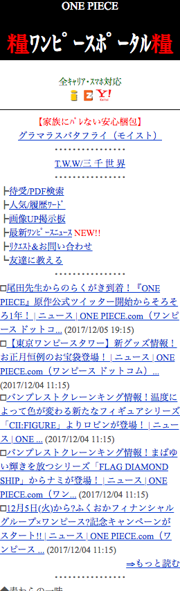

# fp-scraper

 * フィーチャーフォン(ガラケー)のスクレイピング
 * UIDの設定とXMLパースエラーの回避

||||||
|:---:|:---:|:---:|:---:|:---:|

## Getting Started

### Installation

```
npm i fp-scraper
```

### Usage

#### (1) Basic Usage

```js
const FpScraper = require('fp-scraper');

(async() => {
  const scraper = new FpScraper({
    urls: ['http://k.nhk.jp/']
  });

  await scraper.scrape();
})();
```

#### (2) Setting UID

```js
const FpScraper = require('fp-scraper');

(async() => {
  const scraper = new FpScraper({
    urls: ['http://k.nhk.jp/'],
    uid: 'MY_CUSTOM_UID'
  });

  await scraper.scrape();
})();
```

#### (3) Setting Device

```js
const FpScraper = require('fp-scraper');

(async() => {
  const scraper = new FpScraper({
    urls: ['https://google.com'],
    deviceName: 'PC-Wide'
  });

  await scraper.scrape();
})();
```

#### (4) Setting Callback

```js
const FpScraper = require('fp-scraper');

(async() => {
  const scraper = new FpScraper({
    urls: [
      'http://k.nhk.jp/',
      'http://gamba-osaka.jp/',
      'https://www.fujitv.co.jp/m/',
      'http://onepieceportal.com/',
      'http://www.ex-m.jp'
    ],
    outputDir: './results/screenshot/2018-01-01/',
    cbSuccess: url => {
      console.log(`Done: ${url}`);
    },
    cbError: url => {
      console.log(`Error: ${url}`);
    }
  });

  await scraper.scrape().then(() => {
    console.log('END');
  });
})();
```


#### (5) Setting Puppeteer

```js
const FpScraper = require('fp-scraper');

(async() => {
  const scraper = new FpScraper({
    urls: ['http://onepieceportal.com/', 'http://www.ex-m.jp'],
    customPuppeteer: async(browser, page) => {
      await page.setViewport({ width: 375, height: 1000 });
    }
  });

  await scraper.scrape();
})();
```

## Options

|Name|Type|Default|Description|
|:---|:---|:---|:---|
|urls|Array|[]|スクレイピングするURL一覧|
|uid|String|testUid|FP端末のUID|
|serial|String|testSerial|FP端末の端末製造番号|
|cbSuccess|Function|null|スクレイピング時callback(成功)|
|cbError|Function|null|スクレイピング時callback(失敗)|
|deviceName|String|FP|デバイス名*1|
|puppeteerOptions|Object|{*}|puppeteer設定値|
|customPuppeteer|Function|null|Puppetterのカスタマイズ|
|outputDir|String|./results/screenshot/|結果格納先|

#### *1 Device List

|Name|Description|
|:---|:---|
|FP|Softbank 930SH|
|SP|iPhone 6|
|PC|Chrome(モニタサイズ: 1024x768)|
|PC-Wide|Chrome(モニタサイズ: 1920x1080)|
 
## License

[MIT](http://opensource.org/licenses/MIT)

Copyright (c) 2018-present, cc822jp
